# Architecture diagram (Agents for Humans submission)

```mermaid
flowchart LR
    subgraph signals["Weak signals (reports, not media)"]
        W["Met Office warnings"]
        F["Forecasts + EA river gauges"]
        R["Road ops / gritting"]
        T["Traffic-speed drops"]
        H["Incident history"]
    end
    signals --> LEDGER[("Postgres + PostGIS ledger<br/>SignalEvent + citations")]
    LEDGER --> STRANDS["Strands Agent (TypeScript SDK)<br/>8 zod tools + BeforeToolCall provenance hook<br/>OpenAIModel on free-first chain"]
    STRANDS --> ENGINE["Deterministic risk engine<br/>scoreAt() -> EvidenceCitation[]"]
    ENGINE --> REVIEW[("create_human_review<br/>single write exit")]
    REVIEW --> UI["Decision-Replay dashboard /watch<br/>scrub 00:00 -> now, approve/reject"]
    UI --> AUDIT[("Audit log<br/>named officer + timestamp")]
```

Export: screenshot this mermaid (GitHub renders it) or
`npx -y @mermaid-js/mermaid-cli -i docs/architecture-diagram.md -o docs/architecture.png`
then attach the PNG to the Devpost submission and README.
