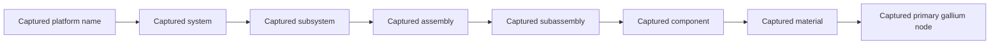

# Dependency explanation visual specification

Date: 2026-10-03
POC: Bothy product/engineering lead
TL;DR: Render one returned chain with every node's provenance visible, beside a separate official gallium context card. This is an original visual specification, not a diagram of a real weapon system.

## Composition

Use the existing cool-neutral Bothy palette and system fonts. Keep the current evidence-first workspace. Do not add military photography, partner logos, glowing networks, or dozens of nodes.

Left: a selected illustrative chain. Render Platform, System, Subsystem, Assembly, Subassembly, Component, and returned Material nodes in their captured relationship order. Adapt the depth to the actual validated query output. Names must come from stored captured rows; do not fill missing hops with invented labels. Attach a row citation and pinned graph revision to the whole chain.

Right: material context with source title/date and link. Use the exact USGS primary low-purity qualification for any concentration figure. Keep the EU classification citation separate. State that neither source verifies the synthetic platform's BOM.

On mobile, stack selected chain, its next verification, and context. A horizontal chain may scroll inside a labeled region but must not force page-level overflow. Provide an equivalent ordered text list and keyboard-operable citation target.

## Frame copy

Title: Why this modeled platform appears in the gallium result

Boundary: Illustrative starter graph. Platform and part identities are synthetic; relationships shown here are captured model evidence, not verified procurement data.

Verification prompt: Confirm the real programme mapping, inventory, qualified alternatives, and timing with an authorized supply-chain owner before drawing an operational conclusion.

## Original diagram scaffold

This is a design scaffold, not captured evidence. Replace each placeholder with a verified returned value before using it in the demo or deck.

Do not include a direct M-to-G arrow in a factual display unless the query actually returns that direct edge. If bounded traversal returns only endpoint connectivity, show the intermediate segment as a labeled bounded relationship and disclose that intermediate node names were not returned.

## Acceptance

- A reviewer can identify the source, synthetic boundary, captured revision, and selected row.
- Every displayed entity and factual edge is supported by the query output or explicitly identified as endpoint connectivity.
- Official context is not mixed into the stored graph as if independently validated platform evidence.
- Empty or missing paths do not establish no exposure.
- The screenshot used in the submission comes from the rehearsed app, not this placeholder scaffold.
